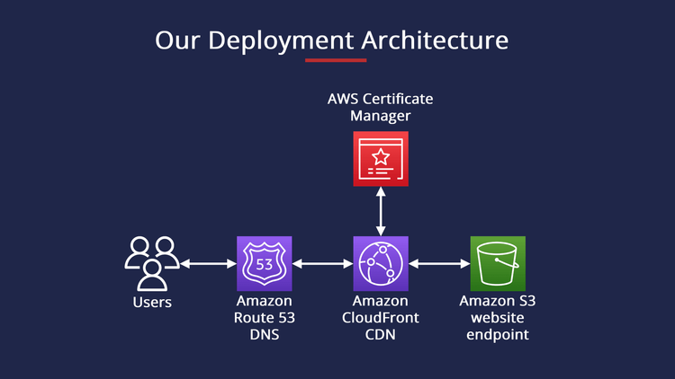

# Example Website Terraform Module with Custom Sub domain

This Terraform module is utilized for deploying a static website on AWS with a custom subdomain, leveraging resources such as S3, CloudFront, Route 53, WAF, and IAM.

## Overview

Using this module, users can easily create a production-ready static website hosted on AWS infrastructure. With features like a secure S3 bucket for website content, CloudFront for optimized delivery, WAF WebACL for site protection, and a custom domain setup through Route 53, the module simplifies the way static websites are deployed and managed.

The configuration also includes an IAM user for facilitating continuous deployment processes directly to the S3 bucket.

### Architecture Diagram



## How to Use This Module

Below is an example of how you can use this module in your Terraform configuration to set up a static website with a custom subdomain.

```hcl
module "website" {
  source  = "../../"
  
  name                 = "example-website"
  environment          = "prod"
  hosted_zone_domain   = "example.com"
  custom_domain_name   = "example-website.example.com"
  create_custom_domain = true
  aws_region           = "us-east-2"
}
```

Make sure to include the `aws` provider block in your configuration:

```hcl
provider "aws" {
  region = "us-east-2"
}
```

### Inputs for Custom Domain Setup

| Name                | Description                                                         | Type       | Default | Required |
|---------------------|---------------------------------------------------------------------|------------|---------|:--------:|
| `name`              | The project/site name                                               | `string`   | n/a     | yes      |
| `environment`       | The environment (e.g., staging, prod)                               | `string`   | n/a     | yes      |
| `hosted_zone_domain`| Your hosted zone domain in Route 53                                | `string`   | n/a     | yes      |
| `custom_domain_name`| The full custom subdomain to set up                                 | `string`   | n/a     | yes      |
| `create_custom_domain` | A flag indicating whether to create a custom domain             | `bool`     | `true`  | no       |
| `aws_region`        | AWS region where resources will be created                         | `string`   | n/a     | yes      |

### Outputs

| Name                      | Description                                 | Sensitive |
|---------------------------|---------------------------------------------|:---------:|
| `cloudflare_domain`       | The direct CloudFront domain                | No        |
| `custom_domain`           | The custom domain name                      | No        |
| `bucket_name`             | The name of the S3 bucket                   | No        |
| `access_key_id`           | Access key ID for the S3 user               | No        |
| `secret_access_key`       | Secret access key for the S3 user           | Yes       |
| `domain_certificate_arn`  | The ARN of the domain certificate           | No        |

Sensitive information like the `secret_access_key` can be accessed using the Terraform CLI command `terraform output secret_access_key`.

## License

This code is provided under the MIT License. See the included [LICENSE.md](LICENSE.md) file for more information.